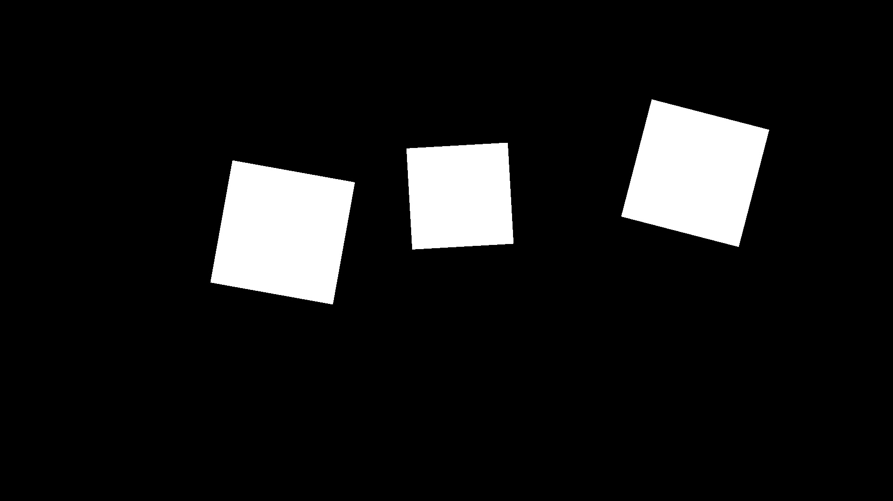
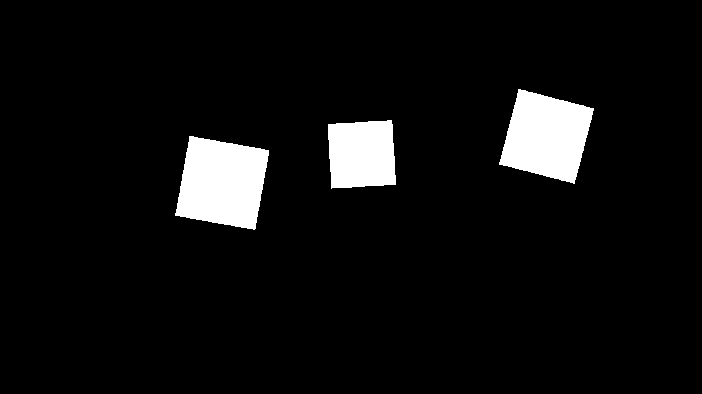

# Unofficial Pytorch implementation (**inference only**) of the SimSwap: An Efficient Framework For High Fidelity Face Swapping

## Attention
***This project is for technical and academic use only. Please do not apply it to illegal and unethical scenarios.***

***In the event of violation of the legal and ethical requirements of the user's country or region, this code repository is exempt from liability.***

## Preparation
### Installation
```
# clone project
git clone https://github.com/mike9251/simswap-inference-pytorch
cd simswap-inference-pytorch

# [OPTIONAL] create conda environment
conda create -n myenv python=3.9
conda activate myenv

# install pytorch and torchvision according to instructions
# https://pytorch.org/get-started/

# install requirements
pip install -r requirements.txt
```

### Important
Face detection will be performed on CPU. To run it on GPU you need to install onnx gpu runtime:

```pip install onnxruntime-gpu==1.11.1```

and modify one line of code in ```...Anaconda3\envs\myenv\Lib\site-packages\insightface\model_zoo\model_zoo.py```

Here, instead of passing **None** as the second argument to the onnx inference session
```angular2html
class ModelRouter:
    def __init__(self, onnx_file):
        self.onnx_file = onnx_file

    def get_model(self):
        session = onnxruntime.InferenceSession(self.onnx_file, None)
        input_cfg = session.get_inputs()[0]
```
pass a list of providers
```angular2html
class ModelRouter:
    def __init__(self, onnx_file):
        self.onnx_file = onnx_file

    def get_model(self):
        session = onnxruntime.InferenceSession(self.onnx_file, providers=['CUDAExecutionProvider', 'CPUExecutionProvider'])
        input_cfg = session.get_inputs()[0]
```
Otherwise simply use CPU onnx runtime with only a minor performance drop.

### Weights
#### Weights for all models get downloaded automatically.

But you can go the old way:\
Download the archive with weights <a href="https://drive.google.com/file/d/1Lhh24Isxriuv2rAgPK_vnpLAsJ3u2bZk/view?usp=sharing">here</a> and extract it inside the repository folder. 

- weights/antelope/scrfd_10g_bnkps.onnx
- weights/arcface_model/arcface_net.jit
- weights/parsing_model/79999_iter.pth
- weights/simswap_224/latest_net_G.pth - official 224x224 model
- weights/simswap_512/390000_net_G.pth - unofficial 512x512 model (I took it <a href="https://github.com/neuralchen/SimSwap/issues/255">here</a>).

## Inference
### Web App
```angular2html
streamlit run app_web.py
```

### Command line App
This repository supports inference in several modes, which can be easily configured with config files in the **configs** folder.
- **replace all faces on a target image / folder with images**
```angular2html
python app.py --config-name=run_image.yaml
```

- **replace all faces on a video**
```angular2html
python app.py --config-name=run_video.yaml
```

- **replace a specific face on a target image / folder with images**
```angular2html
python app.py --config-name=run_image_specific.yaml
```

- **replace a specific face on a video**
```angular2html
python app.py --config-name=run_video_specific.yaml
```

Config files contain two main parts:

- **data**
  - *id_image* - source image, identity of this person will be transferred.
  - *att_image* - target image, attributes of the person on this image will be mixed with the person's identity from the source image. Here you can also specify a folder with multiple images - identity translation will be applied to all images in the folder.
  - *specific_id_image* - a specific person on the *att_image* you would like to replace, leaving others untouched (if there're any other person).
  - *att_video* - the same as *att_image*


- **pipeline**
  - *face_detector_weights* - path to the weights file OR an empty string ("") for automatic weights downloading.
  - *face_id_weights* - path to the weights file OR an empty string ("") for automatic weights downloading.
  - *parsing_model_weights* - path to the weights file OR an empty string ("") for automatic weights downloading.
  - *simswap_weights* - path to the weights file OR an empty string ("") for automatic weights downloading.
  - *device* - whether you want to run the application using GPU or CPU.
  - *crop_size* - size of images SimSwap models works with.
  - *checkpoint_type* - the official model works with 224x224 crops and has different pre/post processings (imagenet like). Latest official repository allows you to train your own models, but the architecture and pre/post processings are slightly different (1. removed Tanh from the last layer; 2. normalization to [0...1] range). **If you run the official 224x224 model then set this parameter to "official_224", otherwise "none".**
  - *face_alignment_type* - affects reference face key points coordinates. **Possible values are "ffhq" and "none". Try both of them to see which one works better for your data.**
  - *erode_mask_value* - a non-zero value. It's used for the post-processing mask size attenuation. You might want to play with this parameter.
  - *smooth_mask_value* - an odd non-zero value. It's used for smoothing edges of the post-processing mask. Usually is set to *erode_mask_value* + 1.
  - *face_detector_threshold* - values in range [0.0...1.0]. Higher value reduces probability of FP detections but increases the probability of FN.
  - *specific_latent_match_threshold* - values in range [0.0...inf]. Usually takes small values around 0.05.

### Examples of post-processing mask

<details>
<summary><b>Effect of the erode_mask_value</b></summary>

erode_mask_value = 0

erode_mask_value = 20

erode_mask_value = 40

</details>

<details>
<summary><b>Effect of the smooth_mask_value</b></summary>

smooth_mask_value = 21

smooth_mask_value = 41

smooth_mask_value = 61

</details>

### Overriding parameters with CMD
Every parameter in a config file can be overridden by specifying it directly with CMD. For example:

```angular2html
python app.py --config-name=run_image.yaml data.specific_id_image="path/to/the/image" pipeline.erosion_kernel_size=20
```

## Video

<details>
<summary><b>Official 224x224 model, face alignment "none"</b></summary>

[](https://vimeo.com/728346715)

</details>

<details>
<summary><b>Official 224x224 model, face alignment "ffhq"</b></summary>

[](https://vimeo.com/728348520)

</details>

<details>
<summary><b>Unofficial 512x512 model, face alignment "none"</b></summary>

[](https://vimeo.com/728346542)

</details>

<details>
<summary><b>Unofficial 512x512 model, face alignment "ffhq"</b></summary>

[](https://vimeo.com/728349219)

</details>

## License
For academic and non-commercial use only.The whole project is under the CC-BY-NC 4.0 license. See [LICENSE](https://github.com/neuralchen/SimSwap/blob/main/LICENSE) for additional details.

## Acknowledgements

<!--ts-->
* [SimSwap](https://github.com/neuralchen/SimSwap)
* [Insightface](https://github.com/deepinsight/insightface)
* [Face-parsing.PyTorch](https://github.com/zllrunning/face-parsing.PyTorch)
* [BiSeNet](https://github.com/CoinCheung/BiSeNet)
<!--te-->